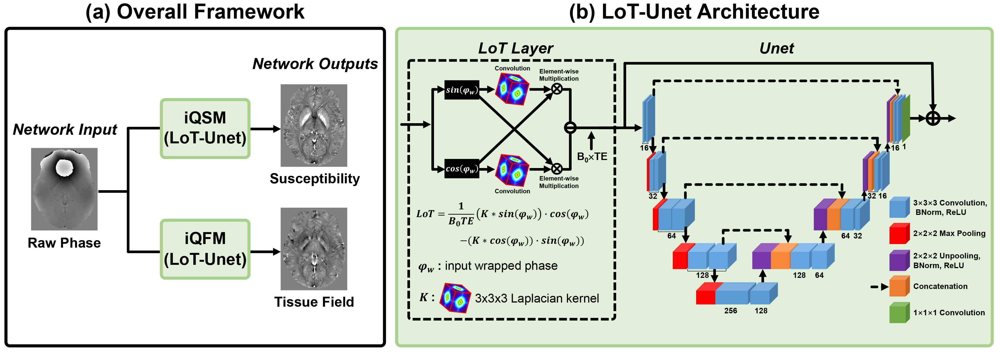
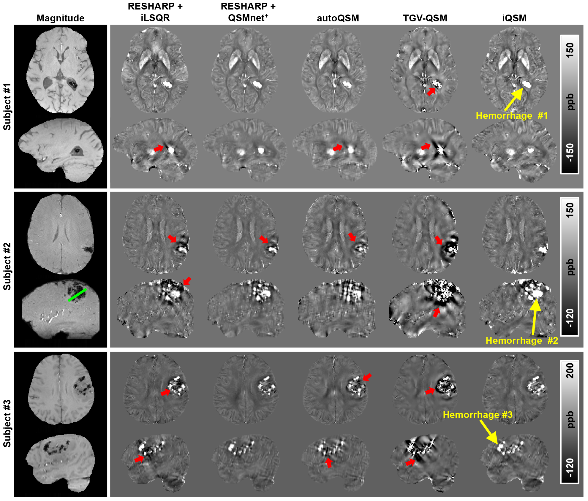

# iQSM – Instant Quantitative Susceptibility Mapping

**Instant Tissue Field and Magnetic Susceptibility Mapping from MRI Raw Phase using Laplacian Enabled Deep Neural Networks**

[NeuroImage 2022](https://www.sciencedirect.com/science/article/pii/S1053811922005274) &nbsp;|&nbsp; [arXiv](https://arxiv.org/abs/2111.07665) &nbsp;|&nbsp; [HuggingFace](https://huggingface.co/sunhongfu/iQSM) &nbsp;|&nbsp; [deepMRI collection](https://github.com/sunhongfu/deepMRI)

iQSM performs single-step, end-to-end local field (iQFM) and susceptibility (QSM) reconstruction directly from raw MRI phase — no separate background field removal step needed. It uses a large-stencil Laplacian preprocessed deep neural network (LoT-Unet).

> **Tip:** For data with resolution finer than 0.7 mm isotropic, interpolate to 1 mm before reconstruction for best results.

---

## Overview



*Fig. 1: iQFM and iQSM framework using the proposed LoT-Unet architecture.*



*Fig. 2: Comparison of QSM methods on ICH patients. Red arrows indicate artifacts near hemorrhage sources.*

---

## Quick Start

### 1. Get the code

**Option A — Git**

```bash
git clone https://github.com/sunhongfu/iQSM.git
cd iQSM
```

**Option B — Download ZIP**

1. Open the GitHub repository page.
2. Click **Code** → **Download ZIP**.
3. Unzip and open a terminal in the folder.

---

### 2. Install dependencies

A fresh virtual environment is the recommended way — it isolates iQSM's dependencies from anything else on your system and avoids version conflicts.

You need Python 3.10 or 3.11. Check your version:

```bash
python --version
```

If Python is not installed, download it from [python.org](https://www.python.org/downloads/). On Windows, tick **Add Python to PATH** during installation.

**Create and activate a virtual environment:**

macOS / Linux:
```bash
python -m venv venv
source venv/bin/activate
```

Windows:
```powershell
python -m venv venv
venv\Scripts\activate
```

You should see `(venv)` in your prompt. Run this activation command each time you open a new terminal.

**Install PyTorch.** Go to [pytorch.org/get-started/locally](https://pytorch.org/get-started/locally/), select your OS and CUDA version, and copy the install command. For example:

CUDA 12.4 (recommended if you have an NVIDIA GPU):
```bash
pip install torch --index-url https://download.pytorch.org/whl/cu124
```

CPU only (slower, but works without a GPU):
```bash
pip install torch --index-url https://download.pytorch.org/whl/cpu
```

**Install remaining dependencies.** Pick one of the two options below depending on whether you want the browser-based web app:

- **Web app + Command-Line** (recommended for most users):

  ```bash
  pip install -r requirements-webapp.txt
  ```

  Includes all base dependencies plus Gradio and Matplotlib for the browser UI and slice previews.

- **Command-Line only** (lighter install, no web stack):

  ```bash
  pip install -r requirements.txt
  ```

---

### 3. Download checkpoints (and optionally demo data)

Large files (checkpoints and demo data) are excluded from git and hosted on Hugging Face: [sunhongfu/iQSM](https://huggingface.co/sunhongfu/iQSM/tree/main).

**Download checkpoints** (required, one-time):

```bash
python run.py --download-checkpoints
```

**Optional — download demo data:**

```bash
python run.py --download-demo
```

This places sample NIfTI files in `demo/`. See [Run Demo Examples](#run-demo-examples) below.

**Manual download (optional).** If the auto-download fails (e.g. behind a firewall), grab the files from Hugging Face and place them as follows:

```text
iQSM/
├── checkpoints/
│   ├── iQSM_50_v2.pth
│   ├── LPLayer_chi_50_v2.pth
│   ├── iQFM_40_v2.pth
│   └── LoTLayer_lfs_40_v2.pth
└── demo/
    ├── ph_single_echo.nii.gz
    ├── mask_single_echo.nii.gz
    └── params.json
```

---

### 4. Run

Choose the web app (recommended) or the command-line interface.

---

## Web App

```bash
python app.py
```

Then open [http://localhost:7860](http://localhost:7860) in your browser.

### Usage

1. **Upload phase file** — click the upload area to select a phase NIfTI (`.nii` / `.nii.gz`). Voxel size and TE are auto-filled from the NIfTI header when available.
2. **Set parameters** — verify echo time, voxel size, B0 field strength, and mask erosion radius.
3. **Brain mask** — optionally upload a BET mask. If omitted, all voxels are processed.
4. **Run** — click **▶ Run Reconstruction**. Use the slice slider to browse the QSM and LFS result volumes.
5. **Download** — output NIfTI files appear in the Results panel when complete. View in [FSLeyes](https://fsl.fmrib.ox.ac.uk/fsl/fslwiki/FSLeyes), [ITK-SNAP](http://www.itksnap.org/), or [3D Slicer](https://www.slicer.org/).

---

## Command-Line Interface

```bash
# Show all options
python run.py --help

# Download demo data (prints example run command)
python run.py --download-demo

# Basic single-echo reconstruction
python run.py --phase ph.nii.gz --te 0.020 --mask mask.nii.gz

# Override output directory
python run.py --phase ph.nii.gz --te 0.020 --output ./my_output/

# Use a YAML config file
python run.py --config config.yaml
```

---

## Run Demo Examples

Once you have downloaded the demo data (`python run.py --download-demo`), you can try iQSM in any of the following ways. The demo is a single-echo GRE acquisition (TE = 20 ms, 3 T, 1×1×1 mm isotropic).

### Option 1 — Web app (one click)

```bash
python app.py
```

Open [http://localhost:7860](http://localhost:7860), click **⬇ Load Demo Data** to pre-fill all inputs (phase, mask, TE, voxel size), then click **▶ Run Reconstruction**.

### Option 2 — Command line

```bash
python run.py \
  --phase demo/ph_single_echo.nii.gz \
  --te 0.020 \
  --mask demo/mask_single_echo.nii.gz
```

Outputs (`QSM.nii.gz` and `LFS.nii.gz`) are written to the current directory by default. Use `--output ./my_output/` to redirect them.

---

## Citation

```bibtex
@article{gao2022instant,
  title={Instant tissue field and magnetic susceptibility mapping from MRI raw phase using Laplacian enabled deep neural networks},
  journal={NeuroImage},
  year={2022},
  doi={10.1016/j.neuroimage.2022.119327}
}
```

---

[⬆ top](#iqsm--instant-quantitative-susceptibility-mapping) &nbsp;|&nbsp; [deepMRI collection](https://github.com/sunhongfu/deepMRI)
